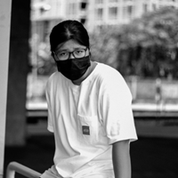

# Chicago-Crime-118 :fire:
  โครงงานนี้เป็นส่วนหนึ่งของวิชา Problem Solving in Information Technology (PSIT)  คณะเทคโนโลยีสารสนเทศ สถาบันเทคโนโลยีพระจอมเกล้าเจ้าคุณทหารลาดกระบัง โครงงานนี้ทำเกี่ยวกับการวิเคราะห์ข้อมูลในหัวข้ออาชญากรรมที่เกิดขึ้นใน Chicago เพื่อวิเคราะห์เกี่ยวกับอาชญากรรมที่เกิดขึนใน Chicago ตั้งแต่ปี 2001 - 2017

## Information :page_facing_up:

Website: https://kuranke.github.io/Chicago-Crime-118/

Last Updated: 17/12/18

Project Status: Complete

Main Language: Python3  

Other Language: HTML, CSS

## Kuranke Team :sunny:

|||||
|:---:|:---:|:---:|:---:|
|[pawanrat11](https://github.com/pawanrat11)|[ChanyaPong](https://github.com/ChanyaPong)|[th4it4y](https://github.com/th4it4y)|[Pawatchaya](https://github.com/Pawatchaya)|
|
Pawanrat Mongkolkittham
:bear:|
Chanya Chansri
:wolf:|
Nitichai Kodchatean
:koala:|
Pawatchaya Kitsareekul
:rabbit: |

## Credits 
- [[View]](https://www.kaggle.com/currie32/crimes-in-chicago) Crimes in Chicago from Kaggle
